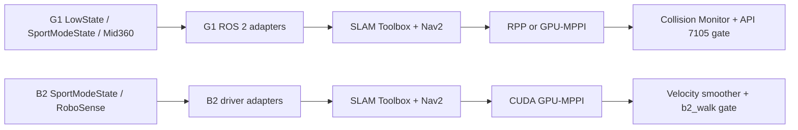

# Unitree G1 & B2 二次开发项目介绍

## 中文版本

本项目是针对宇树科技（Unitree）G1 与 B2 两款机器人平台的二次开发成果集合。

### 自主导航

项目为 G1 和 B2 构建了完整的自主导航应用闭环。技术链路涵盖：

- 订阅宇树官方数据源并转换为 ROS2 标准消息格式；
- 调用 `slam_toolbox` 实现即时建图与重定位；
- 集成 Nav2 导航栈完成路径规划与运动控制；
- 自主开发了速度桥接节点以适配底层驱动。

该链路层层递进、结构清晰，非常适合刚接触 ROS2 机器人导航的初学者从零起步学习。

### 语音交互

项目为 G1 单独开发了专属语音模块，实现了从 ASR（自动语音识别）前端唤醒，到 TTS（语音合成）播报输出的全流程人机语音交互闭环。

---

## English Version

This project is a comprehensive secondary development suite for Unitree's G1 and B2 robotic platforms.

### Autonomous Navigation

We have established a complete closed-loop navigation application for both the G1 and B2. The technical pipeline involves:

- Subscribing to Unitree's official data streams and converting them into ROS2 standard message types;
- Leveraging `slam_toolbox` for real-time mapping and relocalization;
- Integrating the Nav2 stack for path planning and motion control;
- Implementing a custom velocity bridging node to interface with low-level drivers.

With its well-structured, step-by-step architecture, this project serves as an excellent entry point for beginners starting from scratch with ROS2 robot navigation.

### Voice Interaction

We have developed a dedicated voice module specifically for the G1, which realizes a complete human-robot interaction closed-loop—from ASR (Automatic Speech Recognition) wake-up to TTS (Text-to-Speech) audio output.


# Unitree G1 & B2 ROS 2 Navigation Portfolio


[系统架构图](docs/system_architecture.md) · [完整功能包目录](docs/module_catalog.md) · [源码变更审计](docs/source_change_audit.md) · [开发与同步](docs/development_workflow.md)

一个仓库展示两套相互独立的 Unitree 导航工程：G1 侧重完整 ROS 2/Nav2 仿真、定位和安全速度桥；B2 侧重 CUDA GPU-MPPI 控制器、全流程导航与模型失配实验。

> 这是个人研究与工程作品集，不是 Unitree 官方产品。两个子目录是独立的 ROS 2 workspace，不能在仓库根目录混合执行 `colcon build`。

## 项目总览

| 项目 | 导航主链 | 控制器重点 | 当前公开证据 |
|---|---|---|---|
| [G1 Navigation](g1_navigation/README.md) | 状态/点云/里程计 → SLAM Toolbox → Nav2 → Collision Monitor → API 7105 | RPP 默认基线，CPU/GPU-MPPI 可选研究分支 | 13 包构建；110 项测试无失败；提供 Gazebo 复现 |
| [B2 Navigation](b2_navigation/README.md) | SportModeState/雷达 → Nav2 → GPU-MPPI → smoother → 安全运动桥 | CUDA GPU-MPPI、MPC、恢复与模型失配实验 | 5 包构建；15 项测试无失败；离线实验自检通过 |



## 我完成的工程范围

- 打通两种机器人从传感器、TF、里程计、定位、全局规划、局部控制到高层速度接口的完整导航链。
- 将自定义控制器通过 Nav2 `pluginlib` 接口接入 Controller Server，并保留插件解析、参数和动态库链路说明。
- 为 G1 建立 Gazebo 导航代理、虚拟 Mid360、SLAM 定位地图和 Collision Monitor 安全链。
- 为 B2 实现 CPU/GPU MPPI、CUDA rollout/代价计算、控制统计、恢复原型和模型失配实验。
- 将“源码存在、编译通过、离线测试、仿真证据、真机验证”分开记录，避免把配置参数当成实测结论。
- 真机运动默认关闭；地图、限速、超时、有限值检查和人工急停流程均有明确边界。

## 仓库结构

```text
my_unitree_project/
├── g1_navigation/       # 独立 G1 ROS 2 workspace
├── b2_navigation/       # 独立 B2 ROS 2 workspace
├── docs/                # 单仓库开发与同步说明
└── .github/workflows/   # 不接真机的源码级自动检查
```

## 获取代码

```bash
git clone --recurse-submodules https://github.com/fy-55/my_unitree_project.git
cd my_unitree_project
```

B2 的 Unitree ROS 2 依赖是 submodule。如果克隆时未递归获取：

```bash
git submodule update --init --recursive
```

## 分别复现

G1 与 B2 有同名 ROS 包和不同的环境边界，必须在不同终端、不同 workspace 中分别构建：

```bash
cd g1_navigation
./scripts/check_source.sh
# 后续按 g1_navigation/docs/reproduction.md 操作
```

```bash
cd b2_navigation
./scripts/check_source.sh
python3 experiments/mppi_model_mismatch/run_full_1d_experiment.py --self-test-only
# 后续按 b2_navigation/docs/reproduction.md 操作
```

## 真机开发说明

这个仓库是发布快照，不会替代现有的 G1/B2 真机工作区。继续开发时先在各自工作区修改、构建和真机验证，再将已确认的提交同步到本仓库。具体流程见 [开发与同步说明](docs/development_workflow.md)；本次包装对源码和真机默认行为的准确影响见 [源码变更审计](docs/source_change_audit.md)。

## 安全与证据边界

- G1 公开配置默认 `enable_motion=false`，首次受控试验限速为 `0.10 m/s` 和 `0.20 rad/s`。
- B2 默认只启动传感器预检；定位需要显式地图，运动还需要额外指定 `--walk`。
- 公开仓库不包含真实场地地图、rosbag、本机构建目录或本地源码备份。
- 当前构建与静态测试结果不代表两台机器人已经完成本轮真机闭环验证。

## 许可证

两个子项目的本人原创部分均采用 [Apache-2.0](LICENSE)；机器人模型、Unitree 消息、SDK 示例及其他第三方组件保留各自许可证，详见 [THIRD_PARTY_NOTICES.md](THIRD_PARTY_NOTICES.md) 和各子项目说明。
