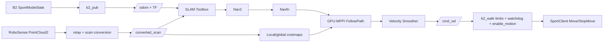

# B2 导航架构



## 反馈闭环

控制器每个周期读取机器人姿态、当前路径和 costmap，生成候选速度序列，在 GPU 上 rollout 并计算代价，只执行最优序列的第一条命令。B2 执行状态再经 `b2_pub` 回到下一控制周期。

```text
Controller Server
  -> GPU rollout/ranking
  -> first command
  -> velocity_smoother
  -> B2 high-level controller
  -> SportModeState
  -> odom/TF
  -> next controller cycle
```

## 安全出口

`b2_walk` 是 Nav2 与真实机器人之间的最后边界：

- 默认 `enable_motion=false`。
- 拒绝 NaN/Inf。
- 对 `vx`、`vy`、`wz` 独立限幅。
- deadband 将微小命令变为停止。
- `cmd_vel` 超时后调用 `StopMove()`。
- 日常启动脚本默认不启动该进程，只有 `--walk` 才显式开启。

这些措施不能替代实体急停和真实刹停距离测试。
