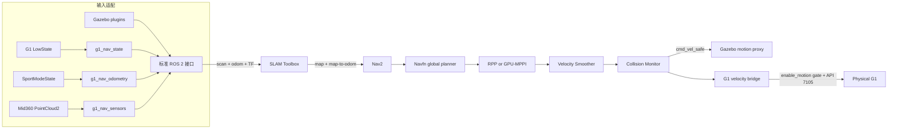

# 系统架构与数据链

## 1. 两条底层链，共用一套导航上层

仿真和真机的区别只保留在输入/执行适配层。两者都向上提供标准的 `/scan`、`/odom` 和 TF，并消费经过碰撞监控后的 `/cmd_vel_safe`。



## 2. TF 责任边界

```text
map -- slam_toolbox --> odom -- g1_nav_odometry/Gazebo --> base_footprint
                                                       |
                                                       +--> base_link --> robot links
```

- `slam_toolbox` 是唯一的 `map -> odom` 发布者；本项目定位模式不并行启动 AMCL。
- `g1_nav_odometry` 或 Gazebo 负责 `odom -> base_footprint`。
- `robot_state_publisher` 根据 URDF 和 `/joint_states` 负责机器人内部 TF。

## 3. 速度链

```text
controller_server / FollowPath
  -> /cmd_vel_nav
  -> velocity_smoother
  -> /cmd_vel
  -> Collision Monitor
  -> /cmd_vel_safe
  -> g1_velocity_bridge or Gazebo
```

`g1_velocity_bridge` 不做步态或关节控制。它只把二维导航速度转换为 G1 已有高层运动服务的 API 7105 请求，并在最终输出前执行独立安全检查。

## 4. 控制器装载链

```text
controller_server
  -> FollowPath.plugin
  -> pluginlib class name
  -> plugins.xml
  -> shared library
  -> Controller implementation
```

`nav2.yaml` 使用 Nav2 RPP。切换到 `nav2_mppi.yaml` 后，`FollowPath` 指向 `nav2_custom_plugins/MPPIGPUController`。模块化 v2 将路径管理、GPU 数据上传、critic、状态机、速度后处理和可视化拆开，便于单独测试或替换。

## 5. 扩展点

| 目标 | 最小修改位置 |
|---|---|
| 更换局部控制器 | `g1_nav_nav2/config/*.yaml` 的 `FollowPath.plugin` |
| 新增 MPPI critic | `nav2_custom_plugins_v2/src/cost/` 与 pipeline |
| 接入新的点云雷达 | `g1_nav_sensors` 的话题和时间戳适配 |
| 更换里程计来源 | 实现标准 `nav_msgs/Odometry`，保持 TF 责任不重复 |
| 增加最终执行安全策略 | `g1_nav_control`，位置在 Collision Monitor 之后 |
| 增加仿真场景 | `g1_nav_sim/worlds` 和 `models` |
