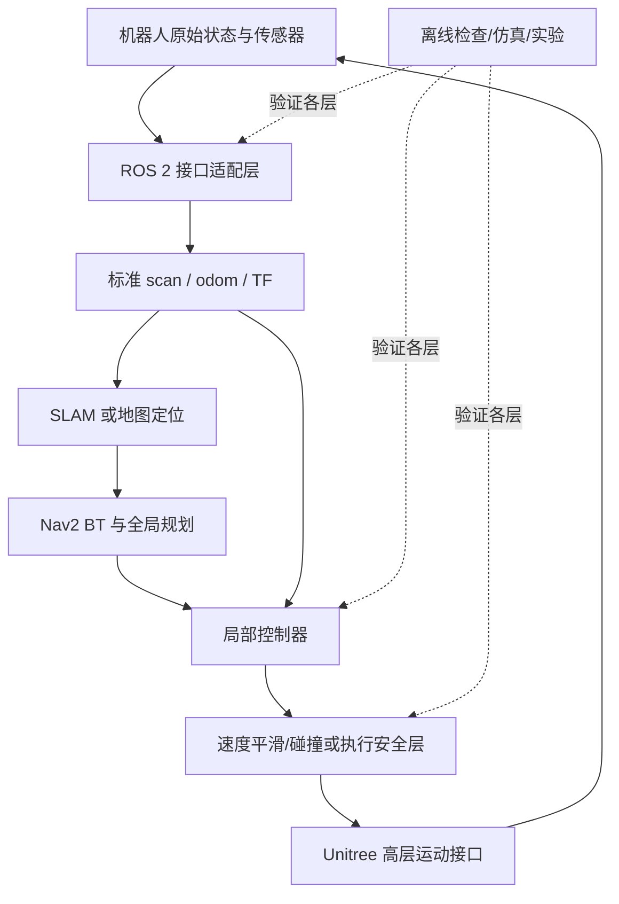
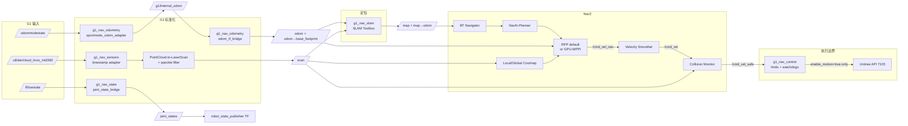
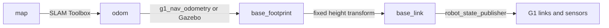
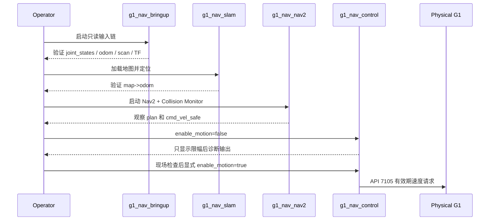
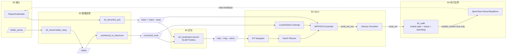
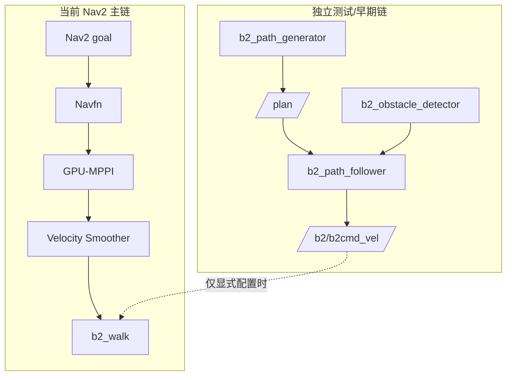
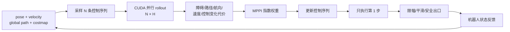
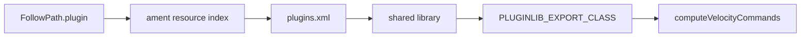

# 系统流程与架构图

## 1. 两个项目的共同分层

两套导航工程采用相似的软件分层，但拥有各自的 ROS 包、参数和运行环境；语音交互项目则是独立的 C++ 应用。

## 2. G1 完整导航流程

### G1 TF 责任

- `map -> odom`：SLAM Toolbox 唯一负责。
- `odom -> base_footprint`：真机由里程计适配器负责，仿真由 Gazebo 负责。
- `base_link -> robot links`：URDF + `/joint_states` 负责。

### G1 启动阶段

## 3. B2 完整导航流程

当前 B2 主 launch 没有启动 Collision Monitor，因此真正的最后软件边界是 `b2_walk`。参数文件中的 Collision Monitor polygon 也处于 disabled；架构图没有把它画成已生效模块。

### B2 主链与早期测试链不要混用

`b2_path_follower` 不是 Nav2 Controller Server 中的 `FollowPath` 插件；它是独立 Pure Pursuit 测试节点。作品集应把这条历史链写成辅助工具，而不是和 GPU-MPPI 主链同时宣传。

## 4. GPU-MPPI 控制周期

### pluginlib 装载链

这条链描述控制器从配置到运行时实现的连接关系；控制器性能和安全性需要结合对应的仿真或真机证据判断。

## 5. 模块间稳定接口

| 层 | G1 契约 | B2 契约 | 替换模块时应保持 |
|---|---|---|---|
| 状态 | `/lf/lowstate`, `/odommodestate` | `lf/sportmodestate` | 时间戳、坐标系和消息语义 |
| 雷达 | `/scan` | `/converted_scan` | `sensor_msgs/LaserScan` 与正确 frame |
| 里程计 | `/odom`, `odom -> base_footprint` | `/odom`, `odom -> base` | `nav_msgs/Odometry` 与唯一 TF 发布者 |
| 全局定位 | `map -> odom` | `map -> odom` | 同一时刻只允许一个发布者 |
| 控制器输出 | `/cmd_vel_nav` | `/cmd_vel_nav` | Nav2 controller remap |
| 平滑后 | `/cmd_vel` | `/cmd_vel` | `geometry_msgs/Twist` |
| 安全后 | `/cmd_vel_safe` | 当前无独立安全话题 | 明确最后执行边界和失效策略 |
| 机器人执行 | API 7105 | SportClient `Move/StopMove` | 默认关闭、有限值、限幅、超时和人工急停 |
