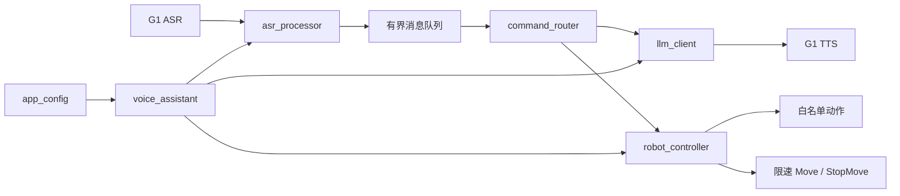

# 系统结构

## 数据流



## 正式运行入口

```text
example/g1/audio/g1_audio_client_test.cpp
```

入口程序负责：

1. 检查 G1 有线网卡参数。
2. 读取并校验环境变量。
3. 初始化 libcurl 和 Unitree DDS 通道。
4. 创建 `VoiceAssistant`。
5. 处理 SIGINT/SIGTERM，并在退出前停止助手。

## 模块职责

| 模块 | 职责 |
| --- | --- |
| `app_config.*` | 读取模型、唤醒、音量、运动限制等配置并做安全校验 |
| `asr_processor.*` | 解析 ASR JSON、清理文本、处理唤醒窗口和去重 |
| `command_router.*` | 将文本分为聊天、手臂、行走、停止四类 |
| `llm_client.*` | 发起 OpenAI 兼容 HTTP 请求，处理超时、取消和响应大小限制 |
| `robot_controller.*` | 调用 TTS、检查 FSM、执行动作、Move 和 StopMove |
| `voice_assistant.*` | 接收 ASR 回调、维护有界队列、启动工作线程并联动模块 |
| `voice_logic_test.cpp` | 不连接 G1 的文本处理和命令路由测试 |

## 运行时顺序

```text
g1_audio_client_test
  -> LoadAppConfig
  -> ChannelFactory::Init
  -> VoiceAssistant::Start
  -> G1 ASR callback
  -> text cleanup / wake check / dedup
  -> bounded queue
  -> command routing
  -> LLM + TTS or fixed robot command
  -> StopMove on stop, error, or shutdown
```

## 模块边界

- `command_router` 只负责本地命令分类和动作白名单匹配。
- `robot_controller` 负责 TTS、固定动作、有限时长运动和停止保护。
- `llm_client` 只负责本地模型请求和响应解析，不直接调用机器人动作接口。
- `asr_processor` 只负责 ASR 文本处理、唤醒窗口和去重。
